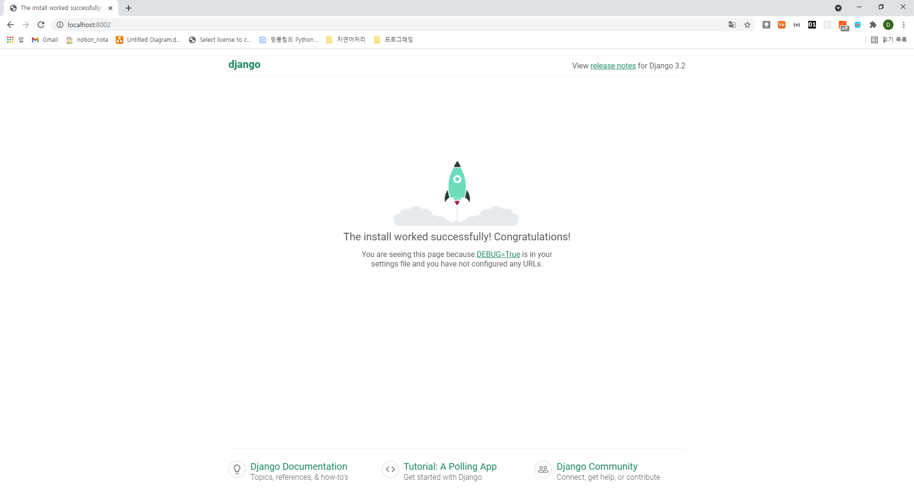
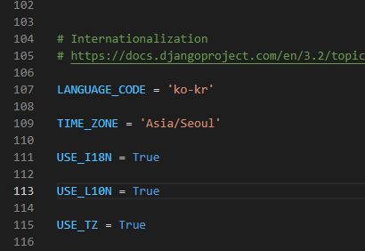

# Django

## history of django

django의 탄생

2005년 7월

2008년 v1.0

2017 v2.0

2019 v3.0 ([release note](https://docs.djangoproject.com/en/3.0/releases/3.0/))

## django의 인기

https://hotframeworks.com


## 카페를 창업하는 두 가지 방법

- A-Z 전부 스스로 하는 방법
- 프렌차이즈 카페를 여는 방법


## 웹 서비스를 제작하는 두 가지 방법

- A-Z 전부 스스로 하는 방법
- 프레임워크를 사용해서 웹 서비스를 제작하는 방법


instagram, nasa, moz://a, youtube가 django를 사용했음


장고는 내부적으로 MVC를 사용하는데 장고는 MTV(model, template, view)로 구성되어 있습니다.


## 가상환경 만들기

1. git bash와 **visual studio code**가 설치되어 있다고 가정합니다.

>  파이썬 버전은 3.6 이상이 요구됩니다.

```shell
# root 폴더 생성
$ mkdir django-study && cd django-study
```

각자의 환경에 맞게 세팅하시면 됩니다. 저는 windows에서 그냥 작업했습니다.

1.1. windows의 경우

```shell
C:\Users\NOTA2001\Desktop\django-study> python -m venv venv
C:\Users\NOTA2001\Desktop\django-study> venv\Scripts\activate.bat
```

1.2. linux의 경우

```bash
$ python -m venv venv
$ vi ~/.bashrc
```

```bash
# ~/.bashrc 의 가장 아래에 한 줄 추가
alias activate="source venv/Scripts/activate"
# venv directory가 있는 디렉토리에서 아래의 명령 실행
activate
```

위의 내용을 .bashrc에 기록합니다.

(linux only)이후로 django-intro 에서 `activate`를 실행하면 됩니다.

리눅스에서 혹시 선호하시는 가상환경 세팅이 있으시면 그렇게 세팅하셔도 좋습니다. 이후에 영향을 미치는 부분은 아닙니다.

(예를 들어, virtualenv-wrapper를 설치하셔서 workon으로 작업환경 바꾸셔도 상관없습니다.)


2. django 설치 및 실행 해보기

```bash
# django install
(venv) python -m pip install pip --upgrade
(venv) pip install django

# django 프로젝트 만들기
(venv) django-admin startproject django_intro
# (venv) django-admin startproject django_intro . # 만약 새 폴더를 만들지 않고, 장고 프로젝트를 시작하려면 .을 붙이면 됨

# 서버 실행
(venv) python manage.py runserver
# 만약 8000번 포트를 사용하고 있는 경우라면, python manage.py runserver 0.0.0.0:8002 로 포트를 바꿔서 실행
```

> tip 현재까지의 폴더 트리 구조 확인: linux에서의 구조도 동일합니다.
>
> 상위 폴더인 django-study2는 다른 것으로 지으셔도 상관없으며, django_intro는 같은 폴더 이름으로 한 번 더 있는 것이 정상입니다.

```
django-study2
├─django_intro
│  │  db.sqlite3
│  │  manage.py
│  └─django_intro
│      │  asgi.py
│      │  settings.py
│      │  urls.py
│      │  wsgi.py
│      │  __init__.py
```





크롬을 켜고 localhost:8000(혹은 지정한 포트로)으로 들어가면, django 페이지가 마중을 나와줍니다 !!


```bash
$ python manage.py startapp pages # pages는 앱 이름입니다.
```


> 현재까지의 폴더 구조

```
django_intro
│  db.sqlite3
│  manage.py
├─django_intro
│  │  asgi.py
│  │  settings.py
│  │  urls.py
│  │  wsgi.py
│  │  __init__.py
└─pages
    │  admin.py
    │  apps.py
    │  models.py
    │  tests.py
    │  views.py
    │  __init__.py
    └─migrations
            __init__.py
```

model.py

django_admin에는 project에 관한 파일들이 있고, 앱을 만들면 앱에 관한 페이지가 나타납니다.


django_intro 밑에 있는 settings.py 파일에서

여기에 INSTALLED_APPS에 'pages'를 한줄 추가해줘야 합니다.




LANGUAGE_CODE도 en-us에서 ko-kr로 바꿔줍니다.


## index페이지 작성(view 부분)

django_intro/pages/views.py를 다음과 같이 수정해줍니다.

```python
from django.shortcuts import render

# Create your views here.
def index(request):
    return render(request, 'index.html')
```


## urls 부분

django_intro/urls.py

```python
"""django_intro URL Configuration

The `urlpatterns` list routes URLs to views. For more information please see:
    https://docs.djangoproject.com/en/2.2/topics/http/urls/
Examples:
Function views
    1. Add an import:  from my_app import views
    2. Add a URL to urlpatterns:  path('', views.home, name='home')
Class-based views
    1. Add an import:  from other_app.views import Home
    2. Add a URL to urlpatterns:  path('', Home.as_view(), name='home')
Including another URLconf
    1. Import the include() function: from django.urls import include, path
    2. Add a URL to urlpatterns:  path('blog/', include('blog.urls'))
"""
from django.contrib import admin
from django.urls import path, include

urlpatterns = [
    path('admin/', admin.site.urls),
    path('', include('pages.urls')), # root url에 연결
]
```

django_intro/pages/urls.py

pages 밑에 urls.py 파일을 새로 생성해 준 후에, 다음과 같이 입력해 줍니다.

```python
from django.urls import path
from . import views

urlpatterns = [
    path('', views.index),
]
```


```python
from django.shortcuts import render

# Create your views here.
def index(request):
    return render(request, 'pages/index.html')
```

위와 같이 적을 수 있는데, 장고가 자동으로 templates를 잡기 때문에 pages부터만 적으면 됩니다.


## 템플릿 만들기

pages/templates/pages/index.html

```html
<!DOCTYPE html>
<html lang="en">
<head>
    <meta charset="UTF-8">
    <meta name="viewport" content="width=device-width, initial-scale=1.0">
    <meta http-equiv="X-UA-Compatible" content="ie=edge">
    <title>Document</title>
</head>
<body>
    <h2>Hi django</h2>
</body>
</html>
```


```bash
$ python manage.py runserver
```

위의 명령어를 실행한 후, index로 접속하면 다음과 같은 창이 뜨게 됩니다.


## 실행 결과(localhost:8000)

