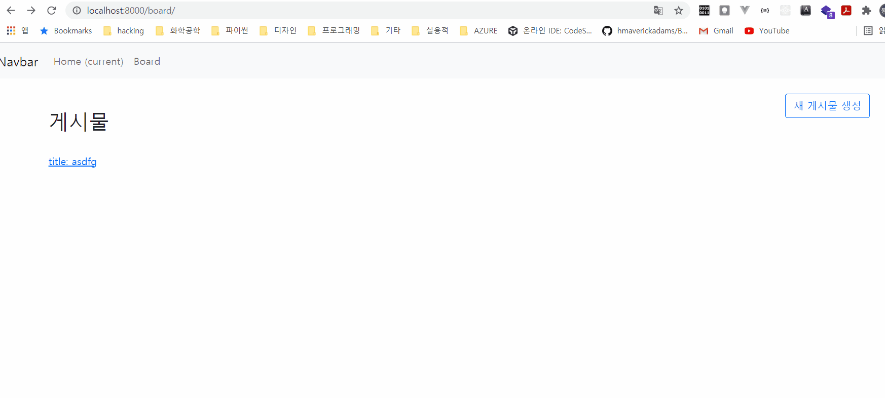

# day10: 게시판 실습

## 제약사항

- 게시물 작성자의 ip를 기록할 것(`request.META.get('REMOTE_ADDR')`)
- 제약 시간 1시간
- CRUD(Create, Read, Update, Delete)의 기능을 전부 구현할 것
- 화면을 어떻게 꾸밀지는 자유입니다.

## 다음 시간에 진행할 내용

- ORM 1:N 관계