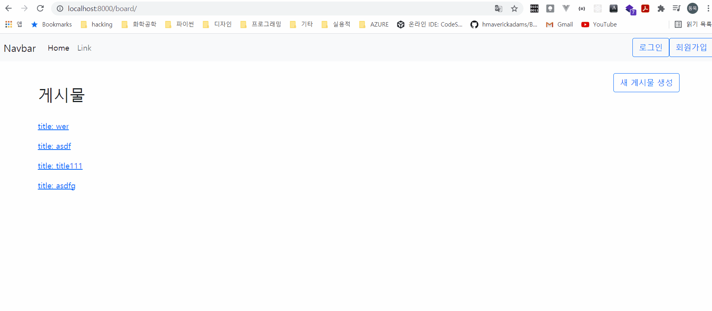

# day12: 인증 (1)


>  day11의 내용을 copy해서 진행하겠습니다.



django에서 user 인증을 하는 방법은 세 가지가 있습니다.

- django의 User 모델을 그대로 사용하기
- django의 User 모델을 확장해서 사용하기
- 새로운 User 모델을 만든 후, django의 User 모델을 대체해서 사용하기
- ~~django  model을 밑 바닥부터 만들어서 django form, admin과 연결~~


오늘 진행할 내용은 django의 기본 User 모델을 이용해서 CRUD + 추가 기능을 구현해 보도록 하겠습니다.


기본 User 모델을 이용해서 구현할 기능들은 다음과 같습니다.

- 회원 등록(Create User)
- 회원 탈퇴(Delete User)
- 로그인
- 로그아웃
- 회원 페이지(Read 기능 / Update 기능)


accounts라는 앱을 새로 만들어 줍니다.

이 앱에서 회원들의 정보를 관리할 예정입니다.

```shell
$ (venv) django-admin startapp accounts
```


## settings.py

방금 추가한 accounts 앱을 추가합니다.

```pytho
...

INSTALLED_APPS = [
	...
    'accounts',
]

...
```


## urls.py

```python
from django.urls import path
from . import views

app_name = "accounts"

urlpatterns = [
    path('signup/', views.signup, name="signup"), # Create
    path('myaccount/', views.myaccount, name="myaccount"), # Read, Update
    path('signout/', views.signout, name="signout"), # Delete
    path('login/', views.user_login, name="login"),
    path('logout/', views.user_logout, name="logout"),   
]
```


## views.py

User라는 모델은 django.contrib.auth.models 안에 들어 있습니다.

이 모델을 그대로 사용하도록 하겠습니다.


```python
from django.shortcuts import render, redirect
from django.contrib.auth.models import User
from django.contrib.auth import authenticate, login, logout, get_user

# Create your views here.
def signup(request):
    if request.method == "POST":
        username = request.POST.get("user_name")
        email = request.POST.get("email")
        passwd = request.POST.get("passwd")
        user = User.objects.create_user(username=username, email=email, password=passwd)
        user.save()
        login(request, user)
        return redirect("pages:index")
    else:
        return render(request, 'accounts/signup.html')

def user_login(request):
    if request.method == "POST":
        username = request.POST.get("user_name")
        passwd = request.POST.get("passwd")
        user = authenticate(username=username, password=passwd)
        if user is not None:
            login(request, user)
        return redirect("pages:index")
    else:
        return render(request, "accounts/login.html")

def myaccount(request):
    if request.method == "POST":
        pass
    else:
        return render(request, "accounts/myaccount.html")

def signout(request):
    if request.method == "POST":
        user = get_user(request)
        user.delete()
    return redirect("pages:index")

def user_logout(request):
    logout(request)
    return redirect("pages:index")
```


## models.py

accounts 앱에서는 django의 기본 User 모델을 사용하기 때문에, 별도의 model 설정이 필요하지 않습니다.


## templates

```html
<!-- login.html -->




<form action="" method="POST">
    
    <!-- <div class="classname"></div> -->
    <!-- .classname -->
    <!-- <a href="" class="btn"></a> -->
    <!-- a.btn -->
    <div class="mb-3">
        <label for="user_name" class="form-label">user_name</label>
        <input type="text" class="form-control" id="user_name" name="user_name">
    </div>
    <div class="mb-3">
        <label for="passwd" class="form-label">password</label>
        <input type="password" class="form-control" id="passwd" name="passwd">
    </div>
    <input type="submit" class="btn btn-primary" value="로그인">
</form>


```


```html
<!-- signup.html -->



<h2>회원 가입</h2>
<form action="" method="POST">
    
    <label for="user_name">user_name: </label>
    <input type="text" name="user_name" id="user_name"><br><br>
    <label for="email">email: </label>
    <input type="email" name="email" id="email"><br><br>
    <label for="passwd">password: </label>
    <input type="password" name="passwd" id="passwd"><br><br>
    <input type="submit" value="회원가입">
</form>

```


```html
<!-- myaccount.html -->


<h2>내 계정 정보</h2>
username: {{user.username}} <br>
useremail: {{user.email}} <br><br><br>

<form action="" method="POST">
    
    <input type="submit" value="회원 탈퇴" class="btn btn-outline-primary">
</form>

```


## 다른 앱에서 user의 로그인 상태 확인

pages/views.py


```python
from django.contrib.auth.models import User
from django.contrib.auth import get_user, login, logout, authenticate

def update(request, pk: int):
    if request.method == "POST":
        if not request.user.is_authenticated:
            return redirect("pages:index")
        ...
```


혹은

```python
def update(request, pk: int):
    if request.method == "POST":
        user = get_user(request)
        if not user.is_authenticated:
            return redirect("pages:index")
        ...
```


이렇게 다른 앱에서도 그대로 User 모델을 사용할 수 있습니다.


## 다른 앱의 template에서 user별로 다른 화면이 보이도록 만들기

```html
<!-- navbar.html -->
...생략...

<form class="d-flex">
        
        <a href="" class="btn btn-outline-primary">{{user.username}}님 환영합니다.</a>
        <a href="" class="btn btn-outline-primary">로그아웃</a>
        
        
        <a href="" class="btn btn-outline-primary">로그인</a>
        <a href="" class="btn btn-outline-primary">회원가입</a>
        
      </form>
```

위에서 보시는 것처럼, 앱 상관 없이 user는 모든 템플릿에 기본적으로 전달됩니다.

따라서 user의 모든 속성 들을 template에서도 그대로 이용할 수 있습니다.


## 다음 시간에 진행할 내용

- 인증 마무리(custom user)