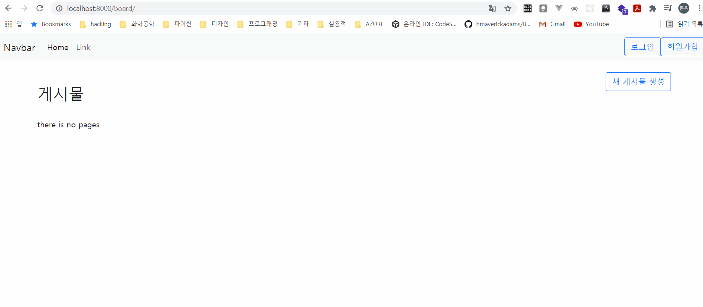
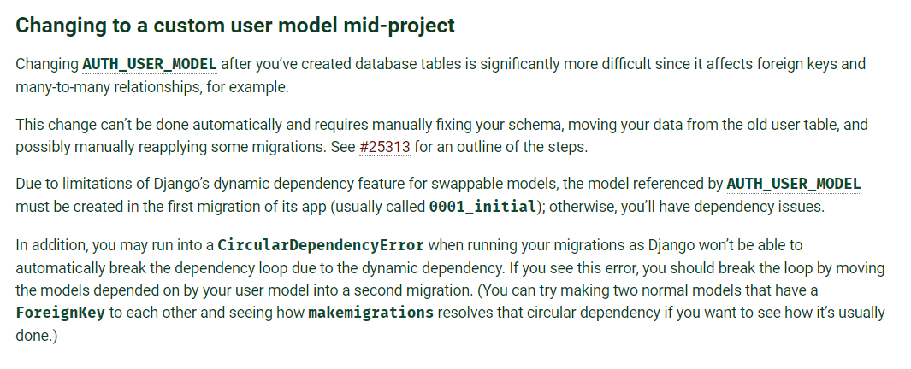

# day13: custom User 모델



Custom User 모델을 이용해서 User의 특정 field(예를 들어 age)를 추가하거나, 인증 방법을 바꾸는 등의 작업을 할 수 있습니다.


저번시간에 말씀드린 것처럼 User 모델을 구현 하는 방식은 3가지가 있습니다.

- django의 User 모델을 그대로 사용하는 방법
- django의 User 모델을 상속받아서 확장하는 방법
- django의 User 모델을 사용하지 않고, basic한 부분만 가져와서 구현하는 방법


오늘은 두 번째, 세 번째 내용에 대해서 진행하겠습니다.

만약 user에 대해서 조금이라도 변경할 계획이 있다면 기본 model이 아니라 custom model을 사용해야 합니다.



(https://docs.djangoproject.com/en/3.2/topics/auth/customizing/#changing-to-a-custom-user-model-mid-project)

중간에 바꾸기가 어렵기 때문입니다.


## AbstractUser를 이용해서 기존의 User model을 확장 하는 방법

공식 사이트에서는 1:1 관계를 이용해서 기존의 User model을 확장할 것을 권장하고 있습니다.

(저는 상속이 좀 더 편한 것 같습니다.)


- 상속 받기

  ```python
  # accounts/models.py
  from django.db import models
  from django.contrib.auth.models import AbstractUser
  
  # Create your models here.
  class MyUser(AbstractUser):
      age = models.IntegerField()
  
      def __str__(self):
          return f"{self.username}"
  ```

  위와 같이 MyUser라는 것을 만들어 주고 AbstractUser를 상속받습니다.

  

- 1:1 관계(OneToOne Field) 사용해서 새로운 모델 만들어서 user에 붙이기

  ```python
  # accounts/models.py
  from django.db import models
  from django.contrib.auth.models import User
  
  # Create your models here.
  class Employee(models.Model):
  	user = models.OneToOneField(User, on_delete=models.CASCADE)
      age = models.IntegerField()
  
      def __str__(self):
          return f"{self.username}"
  ```

  이렇게 설정하면, user에서 user.employee.age 이런 식으로 접근할 수 있습니다.

  

- 나머지 부분 작성

  위에서 상속을 기준으로 작성했다고 가정하고 마저 이어가도록 하겠습니다.

  

  migration을 해 줘야 하는데, 기존의 데이터에서 기본 User를 사용하고 있다면, 변경이 어렵기 때문에 db통째로 날려줍니다.

  (db.sqlite3 파일 삭제)

  그리고 migration들도 지워 줍니다. migrations 폴더에서 `__init__` 파일을 제외하고 날려줍시다. 이 파일이 없으면, 오류가 발생합니다.

  makemigrations, migrate 둘 다 실행 해주도록 합니다.

  

  이어서 admin을 수정합니다.

  ```python
  # accounts/admin.py
  from django.contrib import admin
  from .models import MyUser
  
  # Register your models here.
  admin.site.register(MyUser)
  ```

  admin에서 그냥 간단하게 User를 등록해 줍니다.

  settings.py에서 지금 사용하고 있는 모델을 User로 등록해 줍니다. 맨 마지막 줄에 추가해 주시면 됩니다.

  ```python
  ...
  AUTH_USER_MODEL = "accounts.MyUser"
  ```

  다른 앱에서 User를 사용하고 있다면 그 부분도 아래 처럼 수정해줍시다. author 부분

  ```python
  # pages/models.py
  from django.db import models
  from django.conf import settings
  
  # Create your models here.
  class Page(models.Model):
      title = models.CharField(max_length=40)
      content = models.TextField()
      ip_addr = models.CharField(max_length=20)
      author = models.ForeignKey(settings.AUTH_USER_MODEL, on_delete=models.CASCADE, related_name="pages", null=True)
      created_at = models.DateTimeField(auto_now_add=True)
      updated_at = models.DateTimeField(auto_now=True)
  
  ```

  이제 User를 전부 MyUser로 사용하고 있기 때문에, 원하는 곳에서 MyUser의 속성을 그대로 사용할 수 있습니다.

  아래와 같이 myaccounts.html에 age 정보를 추가해 줍시다.

  ```html
  <!-- myaccount.html -->
  
  
  <h2>내 계정 정보</h2>
  username: {{user.username}} <br>
  age: {{user.age}} <br>
  useremail: {{user.email}} <br><br><br>
  
  <form action="" method="POST">
      
      <input type="submit" value="회원 탈퇴" class="btn btn-outline-primary">
  </form>
  
  ```

  


## AbstractBaseUser를 상속받아서, 기존의 User를 대체 하는 방법

이 방법은 기존의 User를 대체하는 방법입니다.

비밀번호 저장 방법 등 기본적인 User와 관련된 기본적인 기능만 상속을 받고,

나머지(인증 방법, user를 생성하는 방법) 등은 전부 사용자가 생성하는 방법입니다.


이 방법에서는 models에서 크게 두 가지를 신경써야 합니다.

- UserManager
- User model


UserManager는 custum User model에서 objects라는 부분으로 들어가게 됩니다.

```python
# accounts/models.py

from django.db import models
from django.contrib.auth.models import (
    BaseUserManager, AbstractBaseUser
)


class MyUserManager(BaseUserManager):
    def create_user(self, email, date_of_birth, password=None):
        """
        Creates and saves a User with the given email, date of
        birth and password.
        """
        if not email:
            raise ValueError('Users must have an email address')

        user = self.model(
            email=self.normalize_email(email),
            date_of_birth=date_of_birth,
        )

        user.set_password(password)
        user.save(using=self._db)
        return user

    def create_superuser(self, email, date_of_birth, password=None):
        """
        Creates and saves a superuser with the given email, date of
        birth and password.
        """
        user = self.create_user(
            email,
            password=password,
            date_of_birth=date_of_birth,
        )
        user.is_admin = True
        user.save(using=self._db)
        return user


class MyUser(AbstractBaseUser):
    email = models.EmailField(
        verbose_name='email address',
        max_length=255,
        unique=True,
    )
    date_of_birth = models.DateField()
    is_active = models.BooleanField(default=True)
    is_admin = models.BooleanField(default=False)

    objects = MyUserManager()

    USERNAME_FIELD = 'email'
    REQUIRED_FIELDS = ['date_of_birth']

    def __str__(self):
        return self.email

    def has_perm(self, perm, obj=None):
        "Does the user have a specific permission?"
        # Simplest possible answer: Yes, always
        return True

    def has_module_perms(self, app_label):
        "Does the user have permissions to view the app `app_label`?"
        # Simplest possible answer: Yes, always
        return True

    @property
    def is_staff(self):
        "Is the user a member of staff?"
        # Simplest possible answer: All admins are staff
        return self.is_admin
```


```python
# accounts/admin.py
from django import forms
from django.contrib import admin
from django.contrib.auth.models import Group
from django.contrib.auth.admin import UserAdmin as BaseUserAdmin
from django.contrib.auth.forms import ReadOnlyPasswordHashField
from django.core.exceptions import ValidationError

from customauth.models import MyUser


class UserCreationForm(forms.ModelForm):
    """A form for creating new users. Includes all the required
    fields, plus a repeated password."""
    password1 = forms.CharField(label='Password', widget=forms.PasswordInput)
    password2 = forms.CharField(label='Password confirmation', widget=forms.PasswordInput)

    class Meta:
        model = MyUser
        fields = ('email', 'date_of_birth')

    def clean_password2(self):
        # Check that the two password entries match
        password1 = self.cleaned_data.get("password1")
        password2 = self.cleaned_data.get("password2")
        if password1 and password2 and password1 != password2:
            raise ValidationError("Passwords don't match")
        return password2

    def save(self, commit=True):
        # Save the provided password in hashed format
        user = super().save(commit=False)
        user.set_password(self.cleaned_data["password1"])
        if commit:
            user.save()
        return user


class UserChangeForm(forms.ModelForm):
    """A form for updating users. Includes all the fields on
    the user, but replaces the password field with admin's
    disabled password hash display field.
    """
    password = ReadOnlyPasswordHashField()

    class Meta:
        model = MyUser
        fields = ('email', 'password', 'date_of_birth', 'is_active', 'is_admin')


class UserAdmin(BaseUserAdmin):
    # The forms to add and change user instances
    form = UserChangeForm
    add_form = UserCreationForm

    # The fields to be used in displaying the User model.
    # These override the definitions on the base UserAdmin
    # that reference specific fields on auth.User.
    list_display = ('email', 'date_of_birth', 'is_admin')
    list_filter = ('is_admin',)
    fieldsets = (
        (None, {'fields': ('email', 'password')}),
        ('Personal info', {'fields': ('date_of_birth',)}),
        ('Permissions', {'fields': ('is_admin',)}),
    )
    # add_fieldsets is not a standard ModelAdmin attribute. UserAdmin
    # overrides get_fieldsets to use this attribute when creating a user.
    add_fieldsets = (
        (None, {
            'classes': ('wide',),
            'fields': ('email', 'date_of_birth', 'password1', 'password2'),
        }),
    )
    search_fields = ('email',)
    ordering = ('email',)
    filter_horizontal = ()


# Now register the new UserAdmin...
admin.site.register(MyUser, UserAdmin)
# ... and, since we're not using Django's built-in permissions,
# unregister the Group model from admin.
admin.site.unregister(Group)
```

위 처럼 직접 admin에서 상세하게 조정을 해도 괜찮고,

간단하게

admin.site.register(MyUser)만 해줘도 동작합니다.


```python
# settings.py
AUTH_USER_MODEL = 'accounts.MyUser'
```

settings.py에서 AUTH_USER_MODEL을 등록해 준 후,


각 앱들의 모델에서 다음과 같이 수정해줍니다.

```python
# pages/models.py

from django.db import models
from django.conf import settings

# Create your models here.
class Page(models.Model):
    title = models.CharField(max_length=40)
    content = models.TextField()
    ip_addr = models.CharField(max_length=20)
    author = models.ForeignKey(settings.AUTH_USER_MODEL, on_delete=models.CASCADE, related_name="pages", null=True)
    created_at = models.DateTimeField(auto_now_add=True)
    updated_at = models.DateTimeField(auto_now=True)
```

사용되는 모델을 기존의 User 모델에서 settings.AUTH_USER_MODEL로 바꿨습니다.

즉 모델에서 다른 모델의 키로 들어 갈 때는, string과 models.Model의 두 가지 형식 다 받고 있음을 알 수 있습니다.


## 다음 시간에 진행할 내용

- django 마무리
  - M:N 관계
  - 배포(nginx, uwsgi)
  - network 디버깅(wireshark, fiddler)
  - final project 논의

