# day14: django 마무리(ORM M:N 관계, 배포, network debugging, final project 논의)


오늘 중요한 내용은 ORM M:N 관계입니다.

중요도 순은

ORM M:N 관계 >>> 배포 >>> network debugging

입니다.


## ORM M:N 관계

1:N 관계는 대표적인 경우가

게시물:댓글의 관계가 있습니다.

게시물은 댓글을 가지고(has) 있다고 볼 수 있는데,

게시물은 여러 개의 댓글을 가지고 있을 수 있고, 댓글은 하나의 게시물에만 속해있습니다.


M:N의 관계는 다수가 다수에 대해서 관련이 있습니다.

예시로는 의사:환자의 진료예약 관계가 있습니다.

환자 A가 만약 오전에 안과 의사 A, 오후에 내과 의사 B 에게 진료 예약을 했다면,

환자 A는 안과 의사 A, 내과의사 B와 예약 관계가 있습니다.


마찬가지로 안과 의사 A 입장에서도 하루에 예약한 환자가 환자 A, 환자 B... 등이 될 수 있죠

그러면 환자도 의사 다수와 관련이 있고, 의사도 환자 다수와 관련이 있습니다.


이런 관계를 M:N 관계라고 합니다.


M:N 관계를 구현하는 방법은 우리가 예전에 배웠던 방법을 바탕으로 구현한다면 다음과 같이 할 수 있습니다.


### 중계 테이블 방식

doctor와 patient 에서 reservation 관계를 테이블(중계 테이블)을 만들어서 

```python

class Doctor(models.Model):
    name = models.CharField(max_length=20)

class Patient(models.Model):
    name = models.CharField(max_length=20)

class Reservation(models.Model):
    doctor = models.ForeignKey(Doctor, on_delete=models.CASCADE, related_name='reservations')
    patient = models.ForeignKey(Patient, on_delete=models.CASCADE, related_name='reservations')
    appointed_time = models.DateTimeField()
```


이제 migration을 적용하고, 한 번 잘 적용이 되었는 지 확인합시다.

```shell
$ (venv) python manage.py makemigrations
$ (venv) python manage.py migrate

$ (venv) python manage.py shell
>>> from reservation.models import Doctor, Patient, Reservation
>>> d1 = Doctor.objects.create(name="doctor1")
>>> d2 = Doctor.objects.create(name="doctor2") 
>>> d3 = Doctor.objects.create(name="doctor3")  
>>> p1 = Patient.objects.create(name="patient1")
>>> p2 = Patient.objects.create(name="patient2") 
>>> p3 = Patient.objects.create(name="patient3") 
>>> r1 = Reservation()
>>> r1.doctor = d1
>>> r1.patient = p1
>>> r1.appointed_time = "2021-06-14"
>>> r1.save()
```


- patient에서 doctor 접근

  ```python
  >>> p1 = Patient.objects.get(pk=1)
  >>> p1.reservations.all()
  <QuerySet [<Reservation: doctor: doctor1, patient: patient1>]>
  >>> p1.reservations.all()[0].doctor
  <Doctor: doctor1>
  ```

- doctor에서 patient 접근

  ```python
  >>> d1 = Doctor.objects.get(pk=1)
  >>> d1.reservations.all()
  <QuerySet [<Reservation: doctor: doctor1, patient: patient1>]>
  >>> d1.reservations.all()[0].patient
  <Patient: patient1>
  >>>
  ```

즉, 이 **중계 테이블 방식** 으로는 transaction이 중요한 경우(예를 들어, 관계마다 예약 날짜 등의 특수한 속성이 붙는 경우)에는 중계 테이블을 만들어주는 것이 좋습니다.


### ManyToMany Field 방식

django에서는 각 transaction마다 특성이 없는 경우에는 좀 더 간단하게 M:N 관계를 정의할 수 있도록 지원하고 있습니다.

예를 들어, instagram에서 User와 게시물의 '좋아요' 관계는 M:N 관계입니다. 한 명의 User가 다수의 게시물에 좋아요를 누를 수 있고, 하나의 게시물은 여러 명의 User로부터 좋아요를 받을 수 있습니다.

한 번의 좋아요를 누르는 행위(transaction)은 아까 의사와 환자의 예약 관계처럼 transaction에 중요한 속성이 있지 않기 때문에

ManyToManyField로 두 모델을 연결할 수 있습니다.


models.py를 다음과 같이 수정합시다.

```python
from django.db import models

# Create your models here.
class Doctor(models.Model):
    name = models.CharField(max_length=20)

    def __str__(self):
        return f"{self.name}"

class Patient(models.Model):
    name = models.CharField(max_length=20)
    doctors = models.ManyToManyField(Doctor, related_name="patients")

    def __str__(self):
        return f"{self.name}"
```


migration을 하고, 또 다음과 같이 수정해 봅시다.

```python
$ (venv) python manage.py makemigrations
$ (venv) python manage.py migrate
$ (venv) python manage.py shell

from reservation.models import Doctor, Patient
>>> doctor_house = Doctor.objects.create(name="house")
>>> doctor_house.patients.all()
<QuerySet []>
>>> hwanja = Patient.objects.create(name="hwan ja")
>>> doctor_house.patients.add(hwanja)
>>> doctor_house.patients.all()
<QuerySet [<Patient: hwan ja>]>
>>> hwanja.doctors.all()
<QuerySet [<Doctor: house>]>
```

doctor_house.patients.add(hwanja)로 doctor house의 환자에 hwanja를 추가했는데,

자동으로 hwanja에게도 doctor house가 doctors에 들어갔습니다.

doctor_house.patients.remove(hwanja)로 관계를 삭제할 수도 있습니다.


이제 모델들이 다수:다수 관계에 있는 것도 처리할 수 있습니다.


## 배포

전체 구조는 다음과 같습니다.

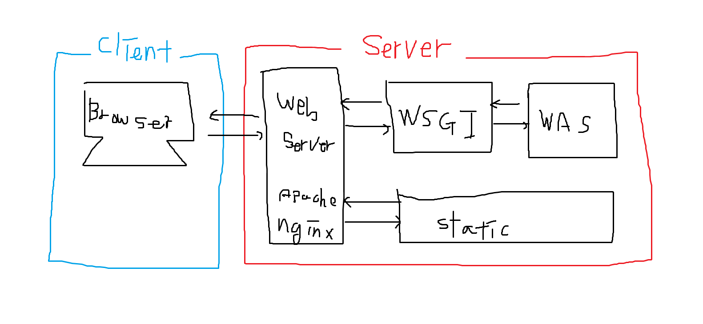

우리가 예전에 배울 때는, urls.py로부터 views, models, templates를 거치는 것으로 배웠었는데

사실 이것은 개발할 때의 환경입니다.

실제 배포 시에는 정적 파일들은 좀 더 빠르게 client에게 전달을 해야 하기 때문에,

django에 내장된 웹서버를 쓰지 않고 nginx라는 웹 서버를 사용하게 됩니다.


위의 그림에서 WAS(Web Application Server)라고 표시된 부분에는 django가 WAS 역할을 합니다.


### Web Server vs WAS(Web Application Server)

- web server
  - web server는 client의 브라우저가 가장 먼저 접하는 부분입니다.
  - web server에서는 정적인 파일들(html, images, font, javascript file, css file, ...)은 여기에서 단순하게 전송해 줍니다.
  - web server는 일반적으로 C/C++로 작성되기 때문에 속도가 빠릅니다.
- web application server
  - web application server는 동적인 처리를 할 필요가 있을 때, webserver가 WAS에 처리를 요청합니다.
  - 그리고 직접 처리 요청을 할 수 없기 때문에, wsgi(web service gateway interface)를 거치게 됩니다.
  - django는 들어온 요청을 python으로 처리해서, 임의의 response를 돌려줍니다.
- WAS로 들어갈 지, 정적 파일로 서빙을 할 지는 uri(Uniform Resource Identifier)로 식별합니다.
  - uri는 http://webserver_example.com/boards/freeboard 이런 식으로 맨 마지막에 확장자가 붙지 않아도 좋습니다.
  - url은 http://webserver_example.com/boards/freeboard/index.html 이런 식으로 파일이 대상이 되어야 합니다.


### 대표적인 web server

- apache, nginx, IIS 등이 있습니다. nginx가 성능이 좋기 때문에, 최근에는 대부분 nginx가 사용되는 것 같습니다.

- nginx 설정

  - apt-get 으로 설치할 수 있습니다. https://www.nginx.com/resources/wiki/start/topics/tutorials/install/

  - ubuntu 계열에서는 /etc/nginx 디렉토리가 생성됩니다.

  - /etc/nginx/sites-available, /etc/nginx/sites-enabled: 이 두 폴더가 중요한데, 일반적으로 sites-available 설정을 작성한 후에 soft link(ln -s 명령어)로 sites-enabled에 링크를 생성합니다.

  - /etc/nginx/sites-available/django-deploy

    ```nginx
    server {
            listen 8000;
            server_name <외부로 노출될 server ip or address>;
    
            location = /favicon.ico { access_log off; log_not_found off; }
    
            location /static/ {
                    root /home/foo/django_test/static;
            }
    
            location / {
                include         /etc/nginx/uwsgi_params;
                uwsgi_pass      django;
            }
    }
    ```

    위의 설정에서 location은 웹으로 노출될 path를 설정합니다.

    location /static/ {}부분은 로컬의 `/home/foo/django_test/static` 폴더의 모든 내용을 외부로 다운로드 받게 해줍니다.

    root 뒤에는 로컬 파일의 경로가 옵니다.

    

    location / {} 부분은 웹의 /로 접근했을 때, django로 연결해 주는 부분입니다.


## wsgi(web server gateway interface)

웹 서버와 WAS의 gateway interface입니다.

대표적으로 uwsgi, gunicorn 등이 있습니다.


uwsgi, gunicorn 등 어떤 것을 사용해도 되지만 wsgi를 사용하겠습니다.


(https://wikidocs.net/6611)

위의 내용이 일반적으로 사용되는 설정입니다. 자세한 내용은 위의 사이트에서 확인해 주세요

- 설치

  ```
  sudo -H pip3 install uwsgi
  ```

- 설정

    ```ini
    ; /home/foo/django_test/run/uwsgi.ini 파일 생성
    
    [uwsgi]
    uid = foo
    base = /home/%(uid)/django_test
    
    home = %(base)/venv
    chdir = %(base)/repo
    module = conf.wsgi:application
    env = DJANGO_SETTINGS_MODULE=conf.settings
    
    master = true
    processes = 5
    
    socket = %(base)/run/uwsgi.sock
    chown-socket = %(uid):www-data
    chmod-socket = 660
    vacuum = true
    ```

    위에서 process 의 개수 등 옵션들을 지정할 수 있습니다.

    

    서비스 등록 스크립트 생성

    ```ini
    [Unit]
    Description=uWSGI Emperor service
    
    [Service]
    ExecStart=/usr/local/bin/uwsgi --emperor /etc/uwsgi/sites
    Restart=on-failure
    KillSignal=SIGQUIT
    Type=notify
    NotifyAccess=all
    StandardError=syslog
    
    [Install]
    WantedBy=multi-user.targetd
    ```

- uwsgi를 실행할 때 emperor 모드가 있는데, emperor 모드는 super user로 실행하게 해줍니다. 그래서, 80번의 port를 사용할 수 있습니다. (supoer user 권한이 아니면, 80번 port에 대해서 listen하지 못 합니다.)


(요즘에는 asgi 4.0이 성능 상의 이유로 자주 쓰이는 듯 합니다.)


### 정리

배포할 때는 django에서 static 파일을 한 곳으로 모으고, 그 것을 nginx를 통해서 serving 해야 합니다. (성능상의 이유입니다.)

settings에서 STATIC_ROOT 라는 폴더를 지정하고, python manage.py collectstatic 명령어로 실행할 수 있습니다.

이후, uwsgi, nginx를 설치하고 설정을 합니다.

이제 외부에서 접속이 되어야 하는데, 만약 접속이 잘 안 된다면 방화벽을 체크해 보시면 됩니다.


## network debugging

앱 단에서 디버깅을 하다 보면, 이유는 알 수 없지만 디버깅이 잘 되지 않는 경우가 있습니다.

이 때는 근본적인 부분을 먼저 보고, 아닌 가능성들을 빠르게 제끼고 디버깅을 해야 합니다.

서버와 서버, 서버와 클라이언트 간에는 network로 통신을 하기 때문에

network의 packet(통신의 단위)을 볼 수 있어야 합니다.


web에서는 특히 proxy tool(client와 server 사이에서 오가는 패킷을 보고, 수정할 수 있음)을 사용해서 디버깅을 쉽게 할 수 있습니다.

network packet 분석 툴로는 wireshark, web proxy tool로는 fiddler를 사용하겠습니다.


- wireshark 설명
  - wire shark는 컴퓨터로 들어오는 모든 종류의 패킷에 대해 관심이 있음
  - TCP/IP 4계층의 패킷에 대해서 구조적으로 헤더들을 볼 수 있음
- fiddler 설명
  - network proxy tool(중간에서 패킷들을 받고, 다시 보내고 할 수 있음)
  - 따라서 이 툴을 이용해서 자세하게 디버깅을 할 수 있음

두 가지 툴 다 비슷한 용도로 사용할 수 있는데,

network의 packet들에 대해서 raw하게 보려면 wireshark가 좋고, http의 request, response 에 대해서 주로 관심이 있으면 fiddler가 좋음


### wire-shark 간단한 사용법 설명

설치는 특별한 것이 없습니다. 리눅스도 설치 가능하나 windows 환경을 좀 더 권장합니다.

실행하면, 다음과 같은 창이 뜹니다. 만약 이 창이 뜨지 않는다면, 관리자 모드로 실행해 주시면 됩니다.

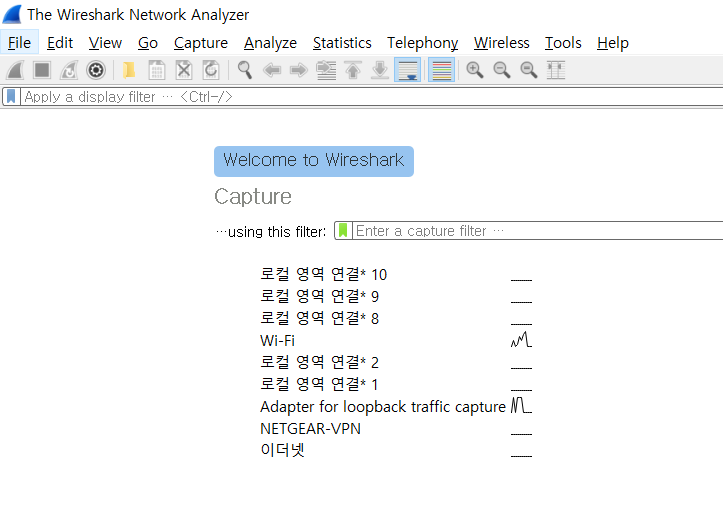

하나의 PC에는 여러 개의 네트워크에 가입되어 있을 수 있습니다. 저는 Wi-Fi에 접근해서 패킷의 내용을 간단하게 보겠습니다.

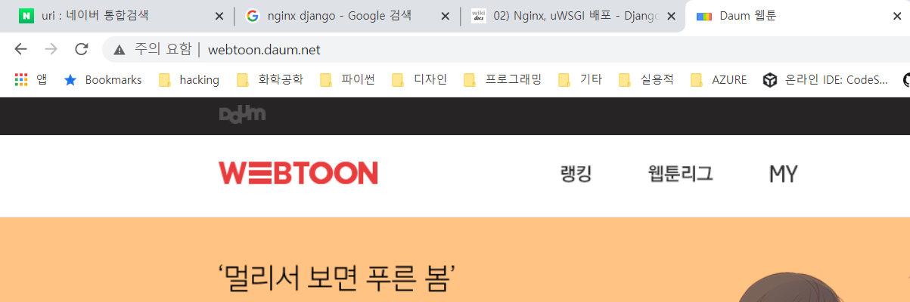

daum 웹툰 사이트에 접근했습니다.

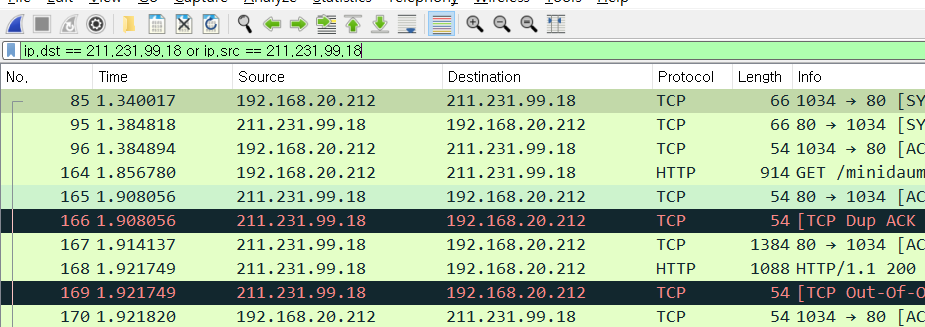


학교에서는 보통 OSI 7계층으로 네트워크를 설명하는 경우가 많은데,

실제로는 TCP/IP 4계층이 좀 더 실용적으로 사용됩니다.

- 1계층 - 네트워크 액세스 계층은 물리 주소(MAC Address)를 사용합니다. 아래에서 정보를 확인할 수 있습니다.

- 2계층 - 인터넷 계층: 아래에서는 IP에 관련된 source ip와 destination ip를 볼 수 있습니다.
  - 프로토콜: IP, ARP, RARP
- 3계층 - 전송 계층: 아래에서는 source port와 destination port를 볼 수 있습니다.
  - 프로토콜: TCP, UDP
- 4계층 - 응용 계층(Application Layer) 은 아래에서 Hyper Text Transfer Protocol에서 확인할 수 있습니다.
  - 프로토콜: FTP, HTTP, SSH


네트워크에서 최소 전송단위는 packet인데, 각 계층별로 하나씩 헤더를 추가하는 방식으로 패킷은 구성되어 있습니다.

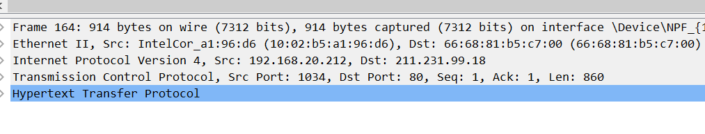

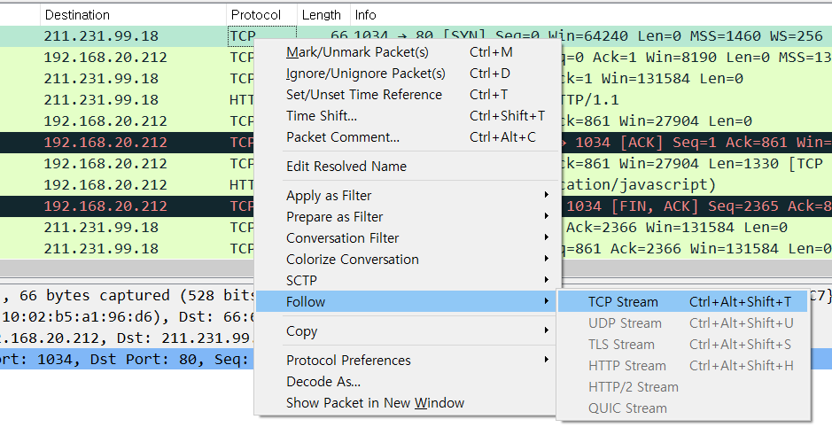

follow TCP Stream으로 선택해서 따라가면, 해당 내용을 확인할 수 있습니다.

HTTP 프로토콜은 TCP 프로토콜에 기반한 application level protocol이므로 다음과 같은 내용을 확인할 수 있습니다.


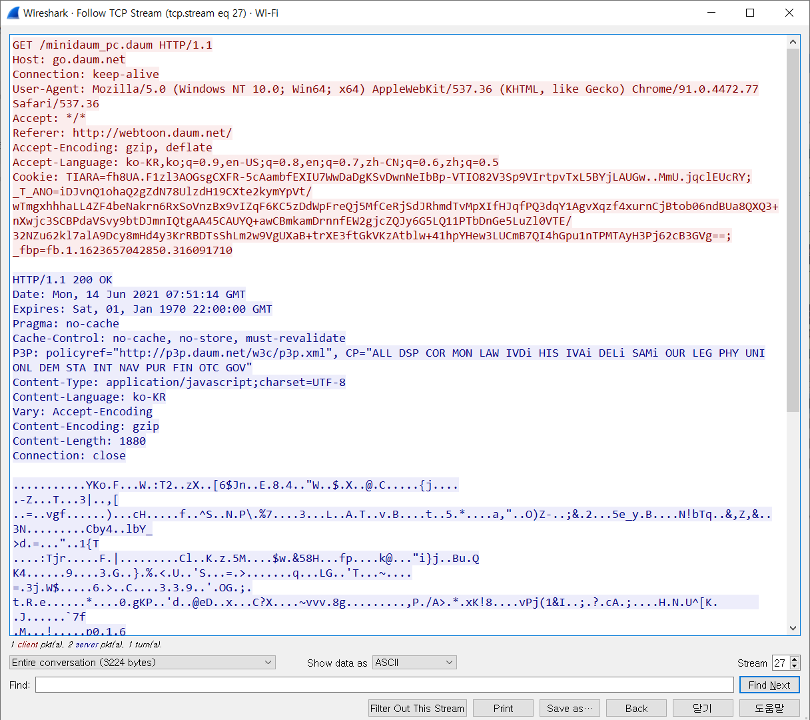

http 헤더 부분은 잘 전송된 것을 볼 수 있지만, 아래 깨진 문자들이 보이기 때문에

show data as ASCII 부분을 hexdump로 바꾸면 아래와 같이 정확한 값을 볼 수 있습니다.

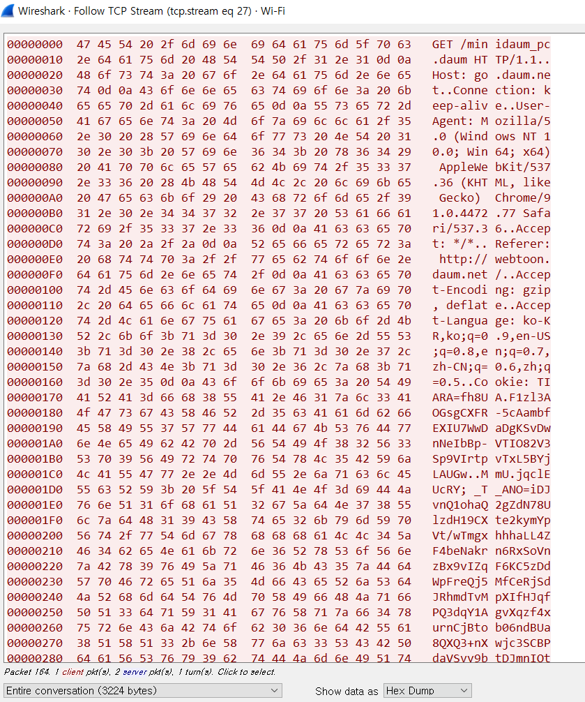


이 외에도, 주고 받은 파일들을 다운로드 받는 기능, usb 통신에 대한 디버깅 등

웬만한 네트워크에서 필요한 기능들은 wireshark에 들어 있습니다.


### fiddler

fiddler는 web proxy tool입니다.

web proxy tool은 client와 server 사이에 존재하면서, server를 대신해서 client에게 server 역할을 합니다.

이런 특성 때문에, 중간에 네트워크 패킷들이 왔다갔다 하는 것도 볼 수 있고,

심지어 변경도 가능합니다.

그래서 정확한 디버깅을 위해서 fiddler를 사용하면 편합니다.


만약 server와 client를 다른 언어를 사용해서 작성했다면, 약간 다른 부분이 있을 수 있는데 그 경우 fiddler를 이용해서 디버깅 하면 좋습니다.


저는 기존에 fiddler 4가 설치되어 있어서, fiddler 4를 사용하겠습니다.

더 최신 버전인 fiddler everywhere로 사용하셔도 기능은 같습니다.


http request에 대해서 request의 구조 보기

- postman에서 request 날리기

  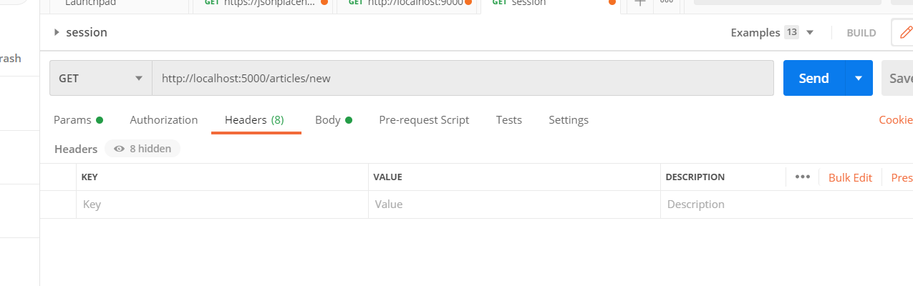

- fiddler에서 내용 확인

  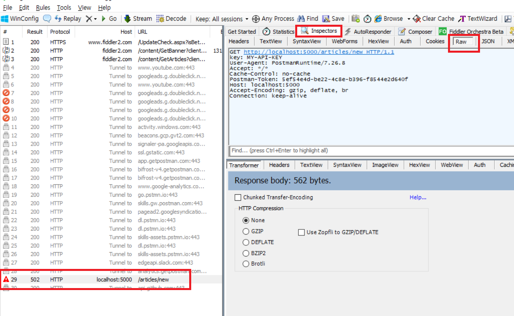

해당 요청을 클릭하고, inspectors => raw로 들어가면 packet의 요청 내용이 있습니다.

http get method로 요청했을 때는 request body에 어떠한 내용도 들어가지 않습니다.

request header에 Connection을 마지막으로 아무 것도 기록되지 않았습니다.


위에서 결과 값을 보려고 하시면, fiddler에서 하단의 창(Response 부분)에서 오른쪽 끝에 Raw라고 적힌 탭을 클릭하시면 됩니다.

(지금은 적절한 response가 돌아오지 않기 때문에 값을 확인할 수 없음)


- GET의 query parameter(query string)의 경우

  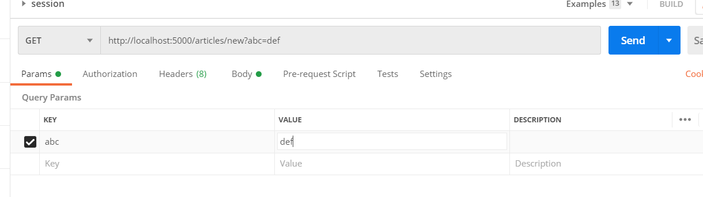

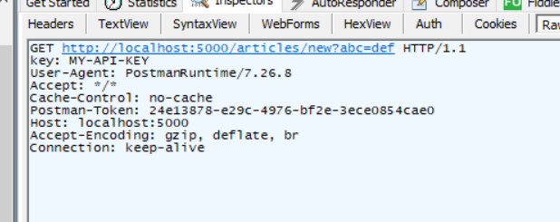

주소 줄에서만 값이 변하는 것을 postman과 fiddler에서 확인할 수 있습니다.


- POST에서 request body에 값 넣기

  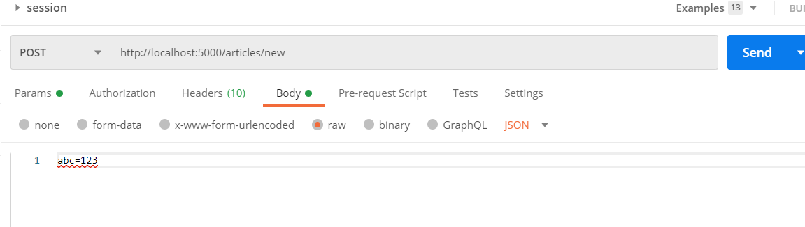

  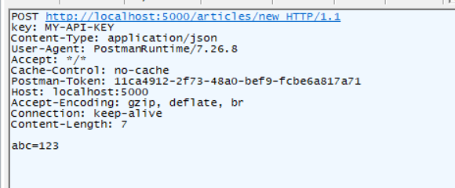


이런 방식으로 모든 종류의 request, response에 대해서 값이 잘 전달 됐는지 디버깅할 수 있습니다.


## final project 논의

중간에 주제를 바꾸셔도 되고, 일주일 후 월요일에 프로젝트가 완성되지 않아도 좋습니다.


- 자유 주제(recap django) - 정훈
- 주제 제안
  - 도서 관리 프로그램(동욱)
  - 익명 twitter(호인)
  - 다른 분들도 원하시는 분들은 제출하셔도 좋습니다.