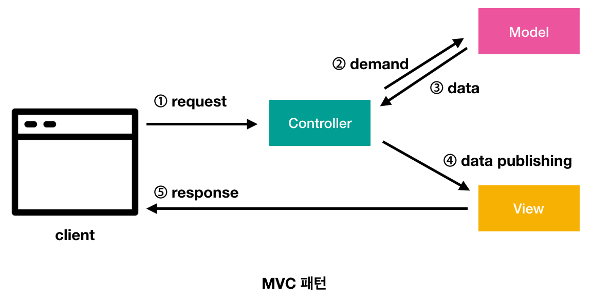
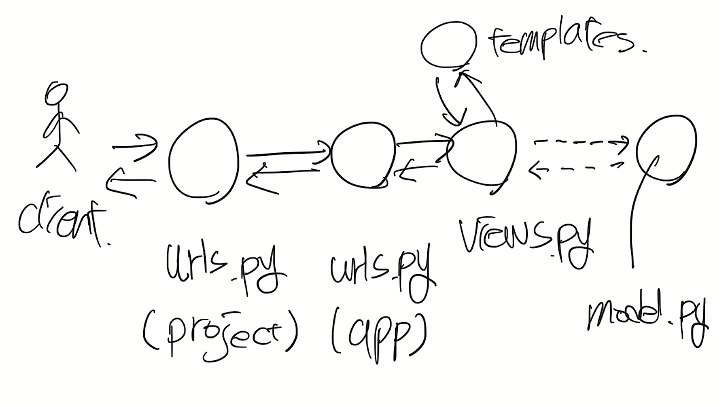

# Django Study Day 2 - MVT Pattern, GET 인자 받기

## 복습([day 1 링크](../day1/))

- venv 가상 환경 생성
- project 생성(django-admin startproject django_intro)
- app 생성(django-admin startapp pages)


## 오늘 학습 내용

- MVT Pattern
- get으로 인자 받기(path params)


## MVT Pattern


### MVC pattern

**MVT(Model View Template) Pattern**은 장고에서 사용하는 디자인 패턴입니다. 폴더 구조가 직접 이 MVT 패턴과 매칭되기 때문에, 추상적인 개념이 아니라, 직관적인 개념이라고 할 수 있습니다.

흔히 웹에서는 MVC(Model View Controller)라는 디자인 패턴을 사용합니다.

이 패턴은 Java 등에서 흔하게 사용되는 디자인 패턴으로서, 코드 간의 종속성을 떨어뜨리고 코드 재사용성을 늘리기 위한 목적으로 사용됩니다.

View는 사용자가 직접 보는 부분을 제어하고,

Controller는 로직을 어떻게 처리할 지를 담당하고,

Model은 데이터와의 연동을 담당합니다.



**장고**에서는 이와 유사하게 **MVT 패턴**을 사용합니다.

Model은 MVC 패턴과 같은 의미입니다. 즉, DB와 연동되어서 데이터 조작 & 관리에 관여합니다.

View는 MVC 패턴의 Controller에 대응되는 개념입니다. python에서 코드를 사용해서 필요한 처리를 합니다.

Template은 화면을 직접적으로 그리는 부분입니다. View에서 넘어온 값들을 html과 섞어서 적절하게 렌더링 하는 부분입니다.



<center>"MVT pattern"</center>


## GET으로 인자 받기

GET에서 주소로 인자 받는 방법은 다음 두 가지가 있습니다.

- path parameter
- query string

오늘 GET으로 인자를 넘겨 받은 부분은 `path parameter`  방식으로 진행했습니다.

인자 받는 방법은 GET의 주소줄 외에도 굉장히 여러 가지가 있는데, 차근차근 정리하도록 하겠습니다.


## 실습(GET method: path parameter로 받기)

자기소개 페이지를 `/introduce`라는 경로에 만들기

---

## get에서 restful 형태로 인자 넘기기

```python
# django_intro/pages/urls.py

from django.contrib import admin
from django.urls import path
from pages import views

urlpatterns = [
    path('introduce/<str:name>/<int:birth_month>/', views.introduce), # <타입:이름> 형식으로 path parameter 받음
]
```

```python
# 뷰: pages/views.py
# context에 dictionary형식으로 넣어줍니다.
# views에서 request 이후에 인자로 받습니다.

from django.shortcuts import render

def introduce(request, name, birth_month):
    context = {'name': name, 'birth_month': birth_month}
    return render(request, 'pages/introduce.html', context)
```

```html
<!-- 템플릿: pages/templates/pages/introduce.html -->
<!DOCTYPE html>
<html lang="en">
<head>
    <meta charset="UTF-8">
    <meta name="viewport" content="width=device-width, initial-scale=1.0">
    <meta http-equiv="X-UA-Compatible" content="ie=edge">
    <title>Document</title>
</head>
<body>
    <p>
        안녕하세요 {{name}}입니다😄.
    </p>
    <p>
        제 생일은 {{birth_month}}월에 있습니다!
    </p>
</body>
</html>
```

아래와 같은 주소로 접근하면, 결과가 나오는 것을 볼 수 있습니다.


> TIP: html 파일 내에서는 emmet을 사용할 수 있습니다. emmet은 입력에 대해서 자동완성을 해주는 기능입니다.
>
> 예) p + tab => p tag 생성, p*2 + tab => p tag 2개 생성 등. 앞으로 많이 사용할 기능이라서, 필요한 기능이 생길 때마다 말씀 드리겠습니다.


`TODO: 결과 넣기`


## 다음 시간 내용

템플릿 파일(html 파일) 에서는 DTL(Django)을 사용해서 반복문과 제어문 등을 사용할 수 있습니다. DTL에 대해서 알아보겠습니다.