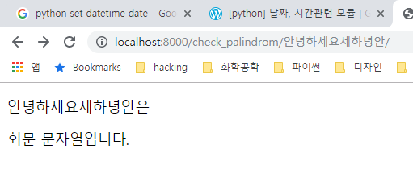

# day4: get으로 요청하고 받기(query string)

## 복습([day3 링크](../day2/3.md))

- DTL(Django Template Language)
  - 변수 값을 view로부터 전달받아서 넣을 때는 `{{}}`
  - DTL을 이용해서 제어 구문 등을 넣을 때는 ``
  - for, if를 사용할 때는 endfor, endif 붙이기
  - for 구문에서는 만약에 아이템이 없는 경우에는 `empty` 사용 가능


## 오늘 학습 내용

- get으로 요청하고 받기(query string)


## 주요 키워드

- query string
- form tag


```python
# pages/urls.py
urlpatterns = [
    path('throw/', views.throw),
    path('catch/', views.catch)
]
```


```python
# pages/views.py
def throw(request):
    return render(request, 'throw.html')

def catch(request):
    message = request.GET.get("message")
    context = {
        'message': message,
        'message2': message2
    }
    return render(request, 'catch.html', context)
```


```html
<!-- pages/templates/pages/throw.html -->
... !+tab해서 앞 부분은 생성...
    <body>
        <form action="/catch/" method="get">
            <input type="text" name="message">
            <input type="text" name="message1">
            <input type="submit" value="제출">
        </form>
    </body>
</html>
```

```html
<!-- pages/templates/pages/catch.html -->
... !+tab해서 앞 부분은 생성...
    <body>
        <h1>
            message: {{message}} <br><br>
            message1: {{message1}}
        </h1>
    </body>
</html>
```


form tag에서 method는 http 프로토콜에서 어떤 메소드를 사용할 지

action은 어떤 곳으로 요청을 보낼 지 입니다.

즉 지금의 form tag를 해석해 보면, message와 message1(form tag는 전송할 때 name으로 구성요소들을 식별합니다.)을

`GET method를 사용해서 (현재 사용하고 있는 서버와 같은 곳의) /catch/라는 곳으로 요청을 보내라`

만약 action에 다른 주소를 넣어도 동작합니다.(예시: `http://naver.com`)


그리고 실행을 해줍니다.

```python
python manage.py runserver
```

localhost:8000/throw/

위의 주소로 접속해서 입력을 하면,

localhost:8000/catch/ 로 주소 이동을 하면서,

값이 전달된 것을 볼 수 있습니다.


## 실습과제: palindrome 판별하기

```python
# pages/views.py
def check_palindrom(request, str_pal):
    n_pal = len(str_pal)
    is_pal = True
    for i in range(0, n_pal//2):
        if str_pal[i] != str_pal[-i-1]:
            is_pal = False
    context = {'is_pal': is_pal, 'str_pal': str_pal}

    return render(request, 'pages/check_palindrom.html', context)
```


```html
<!-- pages/check_palindrom.html -->
<!DOCTYPE html>
<html lang="en">
<head>
    <meta charset="UTF-8">
    <meta name="viewport" content="width=device-width, initial-scale=1.0">
    <meta http-equiv="X-UA-Compatible" content="ie=edge">
    <title>Document</title>
</head>
<body>
    <p>{{str_pal}}은<br></p>

    
        <p>회문 문자열입니다.</p>
    
        <p>회문 문자열이 아닙니다.</p>
    
</body>
</html>
```


