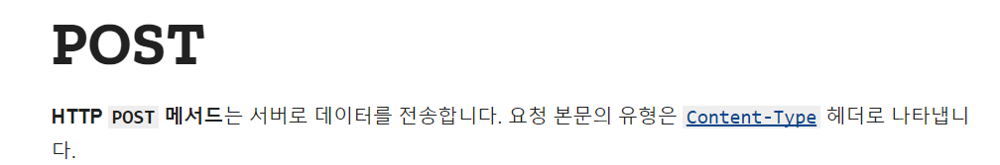
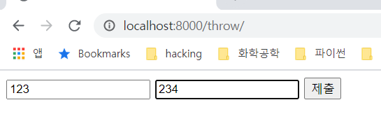
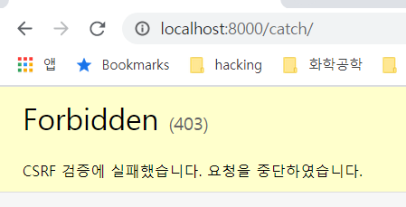
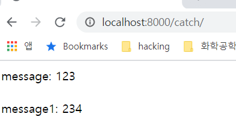
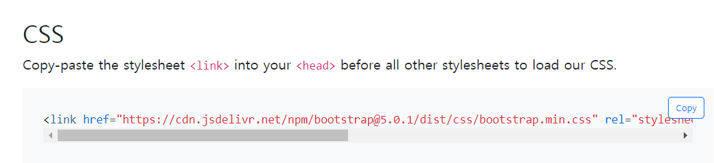
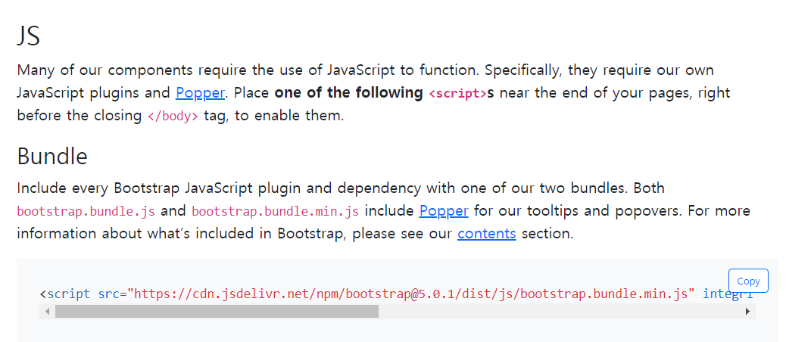
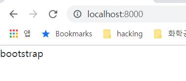
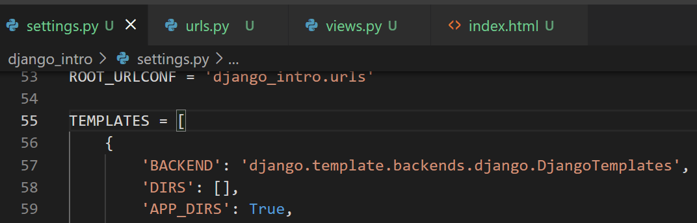
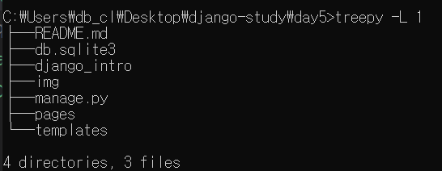
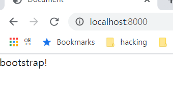

# day5: post로 입력 받기, bootstrap, 템플릿 상속

## 복습([링크](../day4/README.md))

- get으로 요청하고 받기(query string)
- 실습 - palindrome


http의 get method에 데이터를 담는 방식은 다음과 같이 2가지 방식이 있습니다.

- path parameter - e.g. `/홍길동/123 `
- query string - e.g. `?name=홍길동&phone_number=123`

http의 post method는 http message의 body에 데이터가 들어갑니다.

반면, get method는 http message의 body에 어떠한 데이터도 들어가지 않습니다.

(mdn link: https://developer.mozilla.org/ko/docs/Web/HTTP/Messages)


## 오늘 학습 내용

키워드

- (http 프로토콜의) post method
- CSRF / XSS
- bootstrap 적용
- 템플릿 상속


## post method로 데이터 전달/받기

>  settings.py, urls.py 파일은 day4를 참조해주세요


http 프로토콜의 메소드 중 하나인 post method는 서버에 데이터를 전송하는 메소드 입니다.



[MDN](https://developer.mozilla.org/ko/docs/Web/HTTP/Methods/POST)에는 위와 같이 정의 되어 있습니다.


day4와 같이 throw/catch에서 진행을 하겠습니다.

이제는 settings.py와 프로젝트 폴더에 들어있는 urls.py는 별도로 언급하지 않겠습니다.

필요하신 경우 같이 첨부되어 있는 소스코드를 확인해주세요.

```python
# pages/urls.py
from django.urls import path
from . import views

urlpatterns = [
    path('throw/', views.throw),
    path('catch/', views.catch),
]
```


```python
# pages/views.py
from django.shortcuts import render

# Create your views here.
def throw(request):
    return render(request, "pages/throw.html")

def catch(request):
    context = {}
    context["message"] = request.POST.get("message")
    context["message1"] = request.POST.get("message1")
    return render(request, "pages/catch.html", context)
```


day4에서도 throw/catch를 연습했는데, 그 때와 view에서 다른 점은 request.POST를 사용해서 인자를 전달 받았다는 점입니다.


이제 템플릿을 생성하겠습니다.

```html
<!-- pages/templates/pages/throw.html -->
<!DOCTYPE html>
<html lang="en">
<head>
    <meta charset="UTF-8">
    <meta http-equiv="X-UA-Compatible" content="IE=edge">
    <meta name="viewport" content="width=device-width, initial-scale=1.0">
    <title>Document</title>
</head>
<body>
    <form action="/catch/" method="POST">
        <input type="text" name="message">
        <input type="text" name="message1">
        <input type="submit" value="제출">
    </form>
</body>
</html>
```

throw.html 템플릿도 day4와 동일한데, form tag의 method에만 POST가 들어있습니다.

```html
<!-- pages/templates/pages/catch.html -->
<!DOCTYPE html>
<html lang="en">
<head>
    <meta charset="UTF-8">
    <meta http-equiv="X-UA-Compatible" content="IE=edge">
    <meta name="viewport" content="width=device-width, initial-scale=1.0">
    <title>Document</title>
</head>
<body>
    message: {{message}} <br><br>
    message1: {{message1}}
</body>
</html>
```

catch.html은 변경된 것이 없습니다.


`python manage.py runserver`

명령어로 실행 후 결과는 다음과 같습니다.






분명 잘 넣었는데, CSRF 검증에 실패했다고 표시됩니다.

이유는 장고에서 CSRF라는 해킹 공격에 대해 기본적으로 보호해 주기 때문입니다.

(다른 웹 프레임워크는 그렇지 않은 경우도 많습니다.)


throw.html에서 form tag 부분을 다음과 같이 수정을 해줍니다.

```html
<form action="/catch/" method="POST">
    
    <input type="text" name="message">
    <input type="text" name="message1">
    <input type="submit" value="제출">
</form>
```

이렇게 하면, 장고에서 csrf 공격에 대한 방어를 자동으로 해줍니다.


다시 localhost:8000/throw 주소로 들어가서 새로고침 후에 입력을 하면, 다음과 같이 결과가 보이는 것을 알 수 있습니다.




## CSRF/XSS 공격

웹 해킹 방법 중에서 CSRF(Cross Site Request Forgery), XSS(Cross Site Scripting) 공격이 있습니다.

둘 다 html 태그를 삽입할 수 있는 환경에서 할 수 있는 공격입니다.

두 공격의 차이점은 다음과 같습니다.

- CSRF 공격은 다른 서버에 대한 공격입니다.
- XSS 공격은 클라이언트에 대한 공격입니다.


CSRF 공격은 html 태그에 post 메서드 등을 넣어서 다른 서버에, 이 서버가 요청을 보낸 것처럼 위장해서 요청을 보낼 수 있습니다. 만약 다른 서버가 이 서버를 신뢰하고 있는 경우, 데이터 조작 등이 일어나게 됩니다. 서버에 대한 공격이라서 XSS 공격보다 더 위험도가 높습니다.

XSS 공격은 html 태그를 특정 페이지에 삽입함으로써, 다른 유저들에게 영향을 미칩니다. 예를 들어 브라우저는 쿠키 정보에 접근할 수 있는데, 다른 유저의 쿠키 정보를 탈취할 수 있습니다.


## bootstrap 적용

bootstrap은 css 프레임워크의 일종입니다.

css(cascading style sheets)는 html을 꾸미는 역할을 하는데, css로 일일이 다 치는 것이 너무 어렵기 때문에 css를 한꺼번에 적용할 수 있도록 프레임워크가 만들어졌습니다.


bootstrap으로 검색해서 https://getbootstrap.com/  으로 접속합니다.

get started 버튼을 누르면 다음의 화면으로 이동합니다.

https://getbootstrap.com/docs/5.0/getting-started/introduction/


throw/catch는 이제 없애고 다시 새로 view와 template을 만들도록 하죠

아까 POST method 연습을 하던 urls.py를 다음과 같이 수정해줍니다.

```python
# pages/urls.py
from django.urls import path
from . import views

urlpatterns = [
    path('', views.index),
]
```

views.py도 다음과 같이 수정해줍니다.

```python
# pages/views.py
from django.shortcuts import render

# Create your views here.
def index(request):
    return render(request, "index.html")
```

index.html 템플릿을 새로 만들어줍니다.

```html
<!DOCTYPE html>
<html lang="en">
<head>
    <meta charset="UTF-8">
    <meta http-equiv="X-UA-Compatible" content="IE=edge">
    <meta name="viewport" content="width=device-width, initial-scale=1.0">
    <title>Document</title>
</head>
<body>
    
</body>
</html>
```


부트스트랩 페이지로 다시 돌아가서 css의 카피 버튼을 눌러서 카피해줍니다.



< /head > 태그의 바로 위에 넣어줍니다.



JS 태그는 < /body > 태그의 바로 위에 넣어줍니다.

다음과 같은 모양이 됩니다. bootstrap을 body 부분에 넣어줍시다.

```html
<!-- pages/templates/pages/index.html -->
<!DOCTYPE html>
<html lang="en">
<head>
    <meta charset="UTF-8">
    <meta http-equiv="X-UA-Compatible" content="IE=edge">
    <meta name="viewport" content="width=device-width, initial-scale=1.0">
    <title>Document</title>
    <link href="https://cdn.jsdelivr.net/npm/bootstrap@5.0.1/dist/css/bootstrap.min.css" rel="stylesheet" integrity="sha384-+0n0xVW2eSR5OomGNYDnhzAbDsOXxcvSN1TPprVMTNDbiYZCxYbOOl7+AMvyTG2x" crossorigin="anonymous">
</head>
<body>
    bootstrap
    <script src="https://cdn.jsdelivr.net/npm/bootstrap@5.0.1/dist/js/bootstrap.bundle.min.js" integrity="sha384-gtEjrD/SeCtmISkJkNUaaKMoLD0//ElJ19smozuHV6z3Iehds+3Ulb9Bn9Plx0x4" crossorigin="anonymous"></script>
</body>
</html>
```


localhost:800 으로 접속했을 때, bootstrap이라는 글자가 왼쪽 위에 딱 붙으면 bootstrap이 적용된 것입니다.



## template 상속

template의 일부를 공통으로 사용하고 싶은 경우에 template 상속을 사용합니다.

예를 들어서 페이지의 상단에 같은 메뉴 바를 노출시키고 싶다면, template 상속을 이용합니다.


settings.py에 TEMPLATES 부분을 보시면,




위와 같이 DIRS가 있습니다. 여기에 폴더를 추가해 주시면, 여기에서 템플릿을 찾는 추가적인 폴더가 됩니다.

다음과 같이 변경해줍니다.

```python
TEMPLATES = [
    {
        'BACKEND': 'django.template.backends.django.DjangoTemplates',
        'DIRS': [BASE_DIR / "templates"], # os.path.join(BASE_DIR, "templates") 가능합니다.
        'APP_DIRS': True,
        'OPTIONS': {
... 생략
```

os.path.join보다 pathlib의 Path 구문을 사용하는 것이 더 권장됩니다.

templates 폴더를 pages 폴더가 있는 것과 같은 레벨로 생성해 줍니다.



위와 같은 구조가 됩니다.

새로 만든 templates 밑에 base.html을 넣어줍니다.

아까 만든 pages/templates/pages/index.html의 내용을 잘라서 붙여넣어줍니다.


아래와 같이 base.html을 변경해줍니다.

```html
<!-- templates/base.html -->
<!DOCTYPE html>
<html lang="en">
<head>
    <meta charset="UTF-8">
    <meta http-equiv="X-UA-Compatible" content="IE=edge">
    <meta name="viewport" content="width=device-width, initial-scale=1.0">
    <title>Document</title>
    <link href="https://cdn.jsdelivr.net/npm/bootstrap@5.0.1/dist/css/bootstrap.min.css" rel="stylesheet" integrity="sha384-+0n0xVW2eSR5OomGNYDnhzAbDsOXxcvSN1TPprVMTNDbiYZCxYbOOl7+AMvyTG2x" crossorigin="anonymous">
</head>
<body>
    
    
    <script src="https://cdn.jsdelivr.net/npm/bootstrap@5.0.1/dist/js/bootstrap.bundle.min.js" integrity="sha384-gtEjrD/SeCtmISkJkNUaaKMoLD0//ElJ19smozuHV6z3Iehds+3Ulb9Bn9Plx0x4" crossorigin="anonymous"></script>
</body>
</html>
```


index.html도 다음과 같이 변경해줍니다.

```html
<!-- pages/templates/pages/index.html -->


bootstrap!

```


template 상속이 적용되었고, 결과를 확인하면 다음과 같이 부트스트랩이 적용된 bootstrap!이라는 문자열을 볼 수 있습니다.



부트스트랩 사이트에 들어가서 components -> navbar 에 들어가서

적당한 소스코드를 카피해서 base.html에 block content의 윗 부분에 붙여넣어 주면 적용이 됩니다.

## 다음 시간 내용

- serve static files
- ORM

