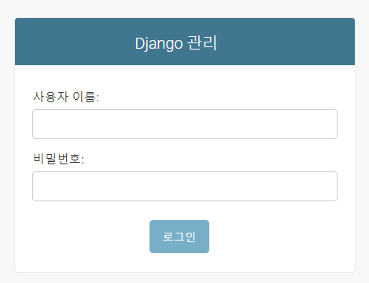
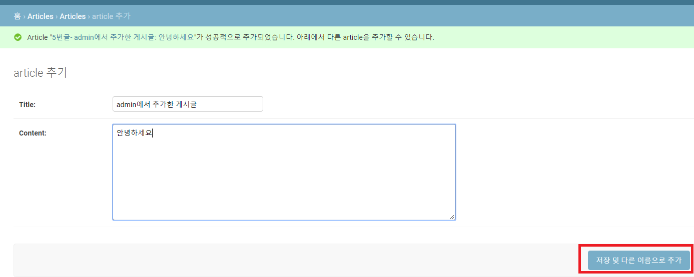
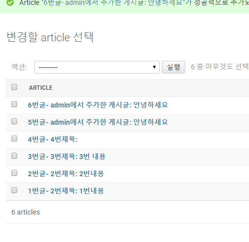
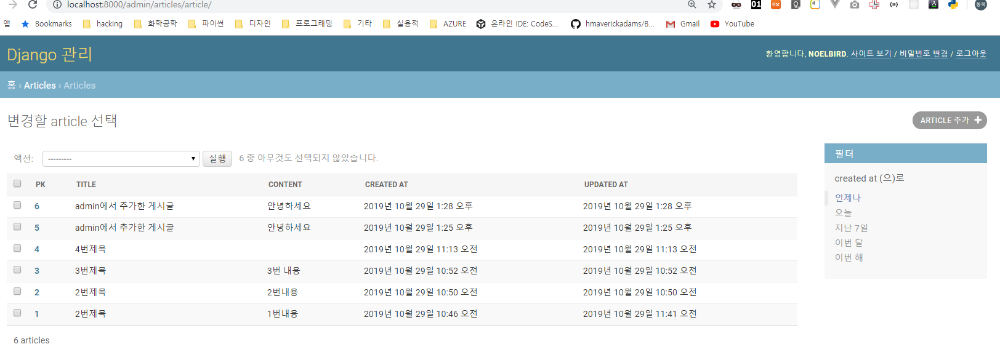

# day7: ORM, CRUD


## 복습([day6](../day6/README.md), [day6-2](../day6-2/README.md))

- static file의 serving에 대해서 학습했습니다.
  - load static이라는 DTL 구문을 사용했었습니다.
- ORM에 대해서 학습했습니다.
  - python manage.py makemigrations
  - python manage.py migrate
  - 데이터(DB에서의 하나의 row)를 생성하는 3가지 방법(`Article()`, `Article(title=)`, `Article.objects.create(title=) `)
- 이제 디자인 패턴인 MTV(Model-Template-View) 모델에 대해서 약간씩은 다뤄봤습니다.


## 오늘 학습 내용

- ORM으로 data 조작 방법
  - all: 모든 항목 가져오기
  - get: 하나의 항목 가져오기
  - filter
    - <column_name>__contains
    - <column_name>__startswith
    - <column_name>__endswith
- django admin
- CRUD 개념 설명


오늘은 day6-2의 폴더를 카피해서 그대로 사용하도록 하겠습니다.

제 github의 day7의 소스코드를 그대로 카피하셔서 사용하셔도 괜찮습니다.


articles라는 이름의 앱에서 모델은 이렇게 구성되어 있습니다.

```python
# articles/models.py

from django.db import models

class Article(models.Model):
    # id값은 장고가 알아서 만들어 줍니다.
    title = models.CharField(max_length=50)
    content = models.TextField()
    created_at = models.DateTimeField(auto_now_add=True)
    updated_at = models.DateTimeField(auto_now=True)
```


오늘은 쉘에서 부터 시작하도록 하겠습니다.

## shell로 들어가기

```bash
$ python manage.py shell
```


## 데이터 가져오기

### get - 하나의 레코드를 가져올 때

```python
>>> article3 = Article.objects.get(pk=3)
# >>> article3 = Article.objects.get(id=3)
# id와 pk는 같습니다.
```


### filter - 필터 적용

```python
# filter 적용하기
>>> article = Article.objects.filter(title='3번제목')
>>> article
<QuerySet [<Article: 3번글- 3번제목: 3번 내용>]>
```


### last - 마지막 항목 가져오기

```python
>>> article = Article.objects.all().last()
>>> article
<Article: 4번글- 4번제목 : >
```


### order_by - 쿼리 결과를 정렬해서 반환

```python
# 오름차순 정렬
>>> articles = Article.objects.all().order_by('pk')
>>> articles
<QuerySet [<Article: 1번글- 1번제목: 1번내용>, <Article: 2번글- 2번제목: 2번내용>, <Article: 3번글- 3번제목: 3번 내용>, <Article: 4번글- 4번제목: >]>
```

```python
# 내림차순 정렬
>>> articles = Article.objects.all().order_by('-pk')
>>> articles
<QuerySet [<Article: 4번글- 4번제목: >, <Article: 3번글- 3번제목: 3번 내용>, <Article: 2번글- 2번제목: 2번내용>, <Article: 1번글- 1번제목: 1번내용>]>
```


### indexing, slicing

```python
# 슬라이싱
>>> articles[:2]
<QuerySet [<Article: 4번글- 4번제목: >, <Article: 3번글- 3번제목: 3번 내용>]>

# 인덱싱
>>> articles[0]
<Article: 4번글- 4번제목: >
```


## 특정 데이터를 포함하는 레코드 찾기

```python
# SQL의 'like' 표현
>>> Article.objects.filter(title__contains='1번')
<QuerySet [<Article: 1번글- 1번제목: 1번내용>]>

# 특정 데이터로 시작하는 것 찾기
>>> Article.objects.filter(title__startswith='1')
<QuerySet [<Article: 1번글- 1번제목: 1번내용>]>

# 특정 데이터로 끝나는 것 찾기
>>> Article.objects.filter(title__endswith='목')
<QuerySet [<Article: 1번글- 1번제목: 1번내용>, <Article: 2번글- 2번제목: 2번내용>, <Article: 3번글- 3번제목: 3번 내용>, <Article: 4번글- 4번제목: >]>
```


## update

단순히 레코드를 가져와서 정보를 바꾸고 save()해주면 정보가 업데이트 됩니다.

```python
>>> article = Article.objects.get(pk=1)
>>> article.title
'1번제목'
>>> article.title = '2번제목'
>>> article.title
'2번제목'
>>> article.save()
```


## delete

```python
>>> article = Article.objects.get(pk=1)
>>> article.delete()
```


## admin page

`localhost:8000/admin`: 페이지에서 관리자 권한으로 데이터를 관리할 수 있습니다.



하지만, 슈퍼유저가 없기 때문에 만들어줘야 합니다.

id: root / pw: root

(실제로 사용할 목적으로 만드실 때는 다른 id, 복잡한 pw로 해주세요..!!)

그리고 validation check는 하지 않도록 y를 입력해줍니다.

```bash
$ python manage.py createsuperuser
사용자 이름 (leave blank to use 'user'): root
이메일 주소:
Password:
Password (again):
Superuser created successfully.
```

(또한 슈퍼유저를 만들려면 최초의 migrate를 해줘야 합니다. 즉, migration을 하지 않은 상태에서는 createsuperuser를 해도 오류가 납니다.)


```python
# articles/admin.py
from django.contrib import admin
from .models import Article

# Register your models here.
admin.site.register(Article)
```




밖으로 나가면 다음과 같이 게시글들이 있습니다.





하지만 깔끔하게 보이도록 하기 위해서 다음과 같이 코드를 추가해 줍니다.

```python
# articles/admin.py
from django.contrib import admin
from .models import Article

# Register your models here.
class ArticleAdmin(admin.ModelAdmin):
    list_display = ('pk','title', 'content', 'created_at', 'updated_at')

admin.site.register(Article, ArticleAdmin)
```




## 다음에 진행할 내용

이제 MTV 패턴과 CRUD 패턴 등 중요한 부분은 배웠습니다.

지금까지 배운 것들을 이용해서 게시판을 만드는 활용을 해보도록 하겠습니다.

(day9에 30분 동안 처음부터 게시판을 만드는 실습을 해보도록 할게요)