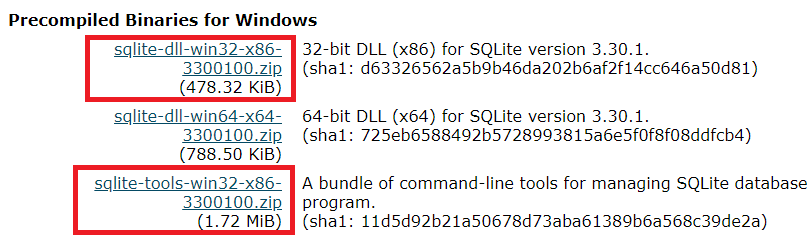
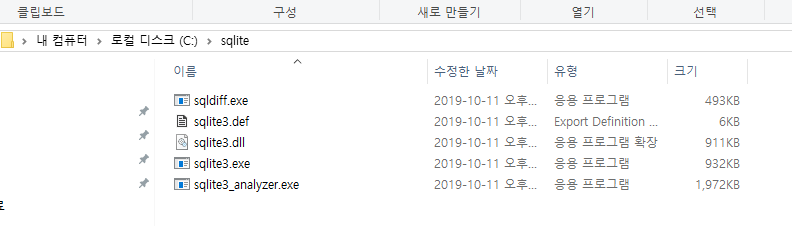
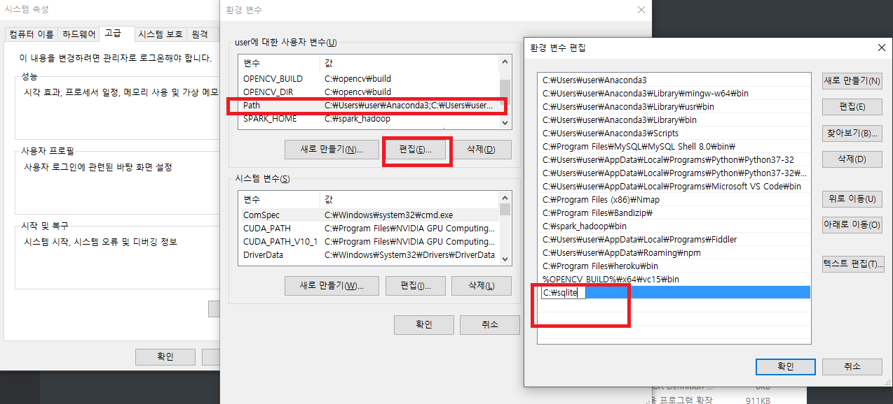
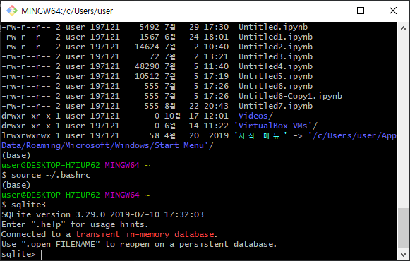
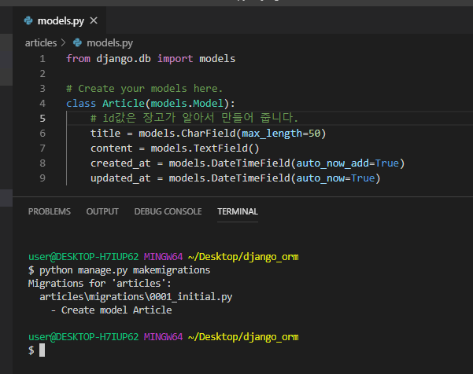
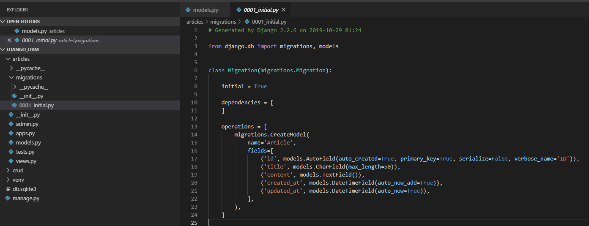
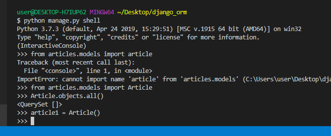

# day6-2: ORM(Object-relational mapping)


# Database

데이터베이스는 체계화된 데이터의 모임입니다.

몇 개의 자료 파일을 조직적으로 통합하여 자료항목의 중복을 없애고 조작할 수 있습니다.

- 스키마(scheme) 데이터베이스에서 자료의 구조, 표현방법, 관계 등을 정의한 구조

1. 어떠한 구조로 데이터를 저장할지 스키마를 만들어야 합니다.
2. 각각의 속성이 어떠한 데이터 타입을 가질지 명시해야 합니다.
3. 우리가 만든 스키마를 토대로 데이터를 조작합니다.


## query문의 종류

- DDL(Data Definition Langauge), DML(Data Manufacturing Language), DCL(Data Control Langauge)
  - DDL의 예: CREATE, DROP, ALTER
  - DML의 예: INSERT, UPDATE, DELETE, SELECT
  - DCL의 예: GRANT, REVOKE

장고에서는 CRUD 오퍼레이션을 ORM을 통해서 합니다.


## sqlite3 다운로드

sqlite3는 서버없이 사용할 수 있는 데이터베이스의 일종입니다.

mysql, mssql 등의 DB는 데이터베이스 서버 프로그램이 실행되어야 하는 반면에,

sqlite3는 서버 프로그램 없이 실행되기 때문에, 쉽게 사용할 수 있습니다.

(모바일 등에서 서버 접속없이 할 때, 주로 사용합니다.)



두 개의 파일을 받아서, 하나의 폴더에 넣어줍니다.






편하게 실행할 수 있도록 환경변수에 path를 등록해줍니다.





이렇게 화면이 뜨면 sqlite3가 잘 설치된 것입니다.


## model 생성

새로 프로젝트를 시작해 줍시다.

프로젝트 이름은 django_crud로 만들어 줍니다.

`django-admin startproject django_crud .`

`django-admin startapp articles`

이번에는 settings.py에서 INSTALLED_APPS 에만 articles를 추가해 주고,

그 외에는 건드리지 않겠습니다.

오늘은 model에 대해서만 집중해서 하도록 하겠습니다.




```python
# models.py

from django.db import models

class Article(models.Model):
    # id값은 장고가 알아서 만들어 줍니다.
    title = models.CharField(max_length=50)
    content = models.TextField()
    created_at = models.DateTimeField(auto_now_add=True)
    updated_at = models.DateTimeField(auto_now=True)
```

```bash
python manage.py makemigrations
```

위의 명령어를 실행시키면, migration 파일이 만들어집니다.

이 생성된 파일은 직접적으로 sql을 만들기 위한 설계도 같은 역할을 합니다.




migrations 폴더에서 우리가 명시한 것보다 좀 더 구체화된 것을 확인할 수 있습니다.

(model file -> migration file)


```bash
python manage.py migrate
```

위의 명령어를 입력해주면, 실제로 sql을 만들어서 반영


sqlite3 db.sqlite3

위의 명령어를 실행하면, sqlite로 진입해서 실제 데이터를 볼 수 있습니다.


- 간단한 sqlite 명령어

```
.table
.exit
```


## shell로 들어가기

```
$ python manage.py shell
```




## record를 만드는 첫 번째 방법(인스턴스를 만든 후 데이터 넣고 save)

```
# Article 클래스를 불러옵니다.
>>> from articles.models import Article

# select * from <table>에 해당하는 명령어 입니다.
>>> Article.objects.all()
<QuerySet []>
>>> article1 = Article()
>>> article1
<Article: Article object (None)>
>>> article1.title = '1번제목'
>>> article1.title
'1번제목'
>>> article1.content = '1번내용'
>>> article1.content
'1번내용'
>>> article1.save()
>>> article1.created_at
datetime.datetime(2019, 10, 29, 1, 46, 35, 161295, tzinfo=<UTC>)
```


## record를 만드는 두 번째 방법(인스턴스를 만들면서 값을 넣어서 초기화 한 후 save)

```
>>> article2 = Article(title='2번제목', content='2번내용')
>>> article2.title
'2번제목'
>>> article2.save()
>>>
```


## record를 만드는 세 번재 방법(create메소드 호출)

```
>>> Article.objects.create(title='3번제목', content='3번 내용')
<Article: Article object (3)>
```


## 데이터 가져오기

### get - 하나의 레코드를 가져올 때

```
>>> article3 = Article.objects.get(pk=3)
# >>> article3 = Article.objects.get(id=3)
# id와 pk는 같습니다.
```

### filter - 필터 적용

```
# filter 적용하기
>>> article = Article.objects.filter(title='3번제목')
>>> article
<QuerySet [<Article: 3번글- 3번제목: 3번 내용>]>
```


## 다음 시간 배울 내용

ORM 마무리,

CRUD 실습